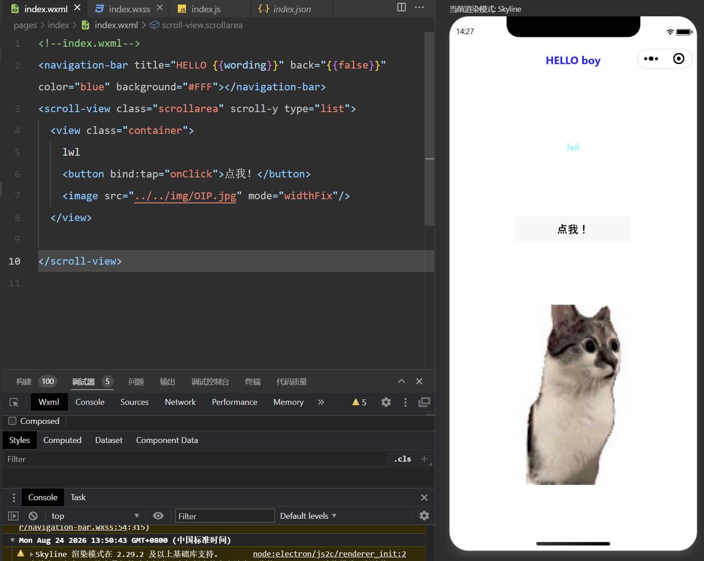
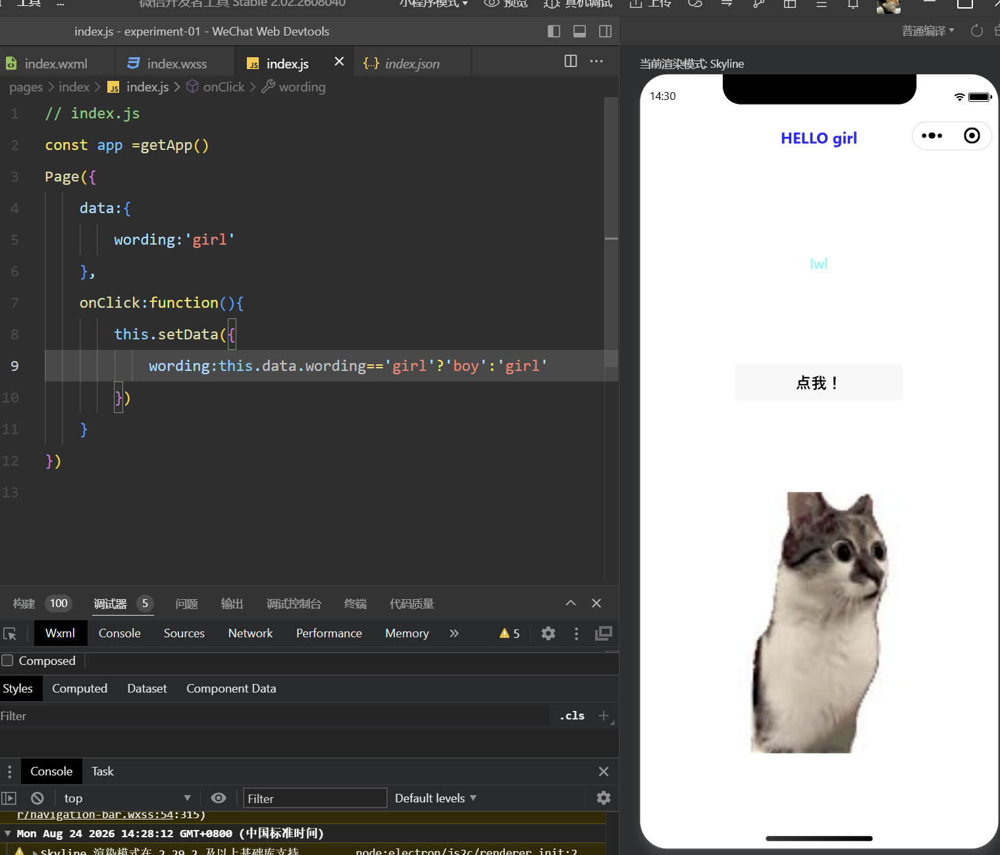
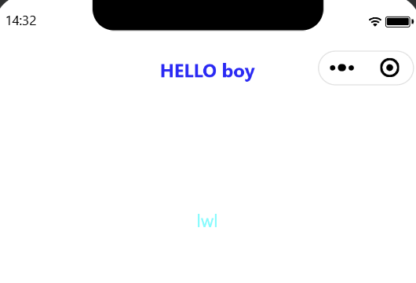
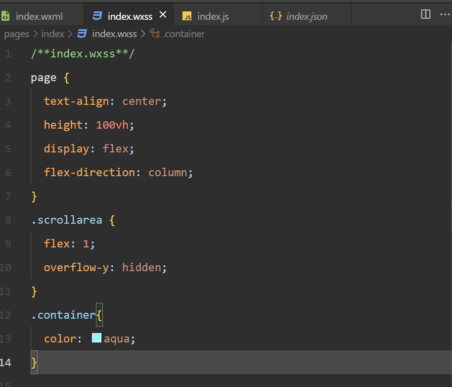

# 2026夏移动软件开发实验一

姓名：李宛霖　　学号：24020007064

| 项目 | 内容 |
| :--- | :--- |
| 课程 | 中国海洋大学26夏《移动软件开发》 |
| 实验名称 | 实验 1：第一个微信小程序 |

<!--more-->

---

## 一、实验内容

### （一）实验目的

这次实验主要是熟悉微信开发者工具，并弄清一个小程序页面是由哪些文件组成的。我在初始项目的基础上修改首页，让页面能显示文字、按钮和本地图片，再用 JavaScript 实现点击按钮切换标题的效果。

### （二）实验过程

#### 1. 找到首页文件

创建项目后，开发者工具自动生成了不少文件。首屏对应的代码在 `pages/index` 中，其中 `index.wxml`、`index.wxss`、`index.js` 和 `index.json` 分别负责页面结构、页面样式、交互逻辑和页面配置。本次实验的主要修改都集中在前三个文件中。

#### 2. 用 WXML 放置页面内容

我在 `index.wxml` 中保留了项目自带的导航栏，将标题写成 `HELLO {{wording}}`。`{{wording}}` 会读取 `index.js` 中同名的数据。页面主体中放入了文字 `lwl`、一个“点我！”按钮和一张猫meme。

图 1　WXML 页面结构及运行效果

button的 `bind:tap="onClick"` 是为了用户点击按钮时，小程序会去 `index.js` 中寻找并执行 `onClick` 函数。

#### 3. 用 JavaScript 切换标题

`wording` 的初始值是 `girl`，所以页面刚打开时标题显示为 `HELLO girl`。每点击一次按钮，`onClick` 就执行一次。我用三元表达式判断当前是 `girl` 还是 `boy`，这样就可以更新数据。

图 2　JavaScript 中的标题切换代码

`wording` 的值发生变化后，WXML 中绑定它的标题会跟着重新显示。

图 3　点击按钮后标题变为 HELLO boy

#### 4. 用 WXSS 调整外观

`index.wxss` 负责当前页面的样式。我让页面文字居中，并把 `.container` 的文字颜色设置为 `aqua`。项目的 `app.wxss` 中也定义了 `.container`，其中的 Flex 布局让文字、按钮和图片纵向排列。两个文件里的样式会同时作用在这个容器上。

图 4　WXSS 页面样式设置

### （三）实验结果

| 操作 | 标题显示 | 页面变化 |
| :--- | :--- | :--- |
| 初始打开 | `HELLO girl` | 显示 `lwl`、按钮和本地图片 |
| 第一次点击 | `HELLO boy` | 页面其他内容不变 |
| 再次点击 | `HELLO girl` | 标题切换回初始状态 |

---

## 二、问题总结与体会

### （一）实验中遇到的问题

#### 1. 本地图片没有显示

我一开始把 `<image>` 写在了 `.container` 外面。检查时先确认了 `img/OIP.jpg` 文件存在，从 `pages/index/index.wxml` 到图片的相对路径 `../../img/OIP.jpg` 也没写错，但模拟器中仍然看不到图片。

后来查看 `app.wxss`，发现 `.container` 设置了 `height: 100%`。图片放在这个容器后面时，会被挤到第一屏下方，所以表面上像是没有渲染。将 `<image>` 移入 `.container` 后，图片就可以和文字、按钮一起显示了。

#### 2. 点击切换标题是否要写 `while`

开始写点击效果时，我以为在 `girl` 和 `boy` 之间反复切换需要用 `while`。实际上，小程序的按钮会在每次点击时重新调用一次 `onClick`，函数内只需要判断当前值并更新一次。使用 `while` 反而会让 JavaScript 一直占用执行过程，页面可能无法继续响应。最后就选择使用三元表达式完成了两个标题的切换。

### （二）实验心得

做完这个小程序后，我对 WXML、WXSS 和 JavaScript 的分工比之前清楚了。WXML 像页面的骨架，它决定页面上有哪些东西，比如标题、文字、按钮和图片。WXSS 是外观部分，同样的内容可以通过它改变颜色、位置和排列方式。JavaScript 负责和人交互，用户点了什么、点击后页面怎么变，这些都是在 JavaScript 中处理的。

这次最直观的是标题切换。WXML 只写了 `{{wording}}`，JavaScript 中的 `setData()` 改变数据后，标题会自动更新。原来我以为要找到标题再手动修改，做完后才理解数据绑定是把页面和数据连在一起。

图片不显示的问题也让我意识到，页面没有按预期显示时，不能只检查文件路径。图片文件和路径都可能没问题，布局样式也可能把内容挤到看不见的位置。以后再遇到类似情况，我会同时检查 WXML 的层级和 WXSS 的尺寸设置。

---

> 作者: 7M7  
> URL: https://7m7666.github.io/posts/2026-summer-mobile-development-experiment-1/  

