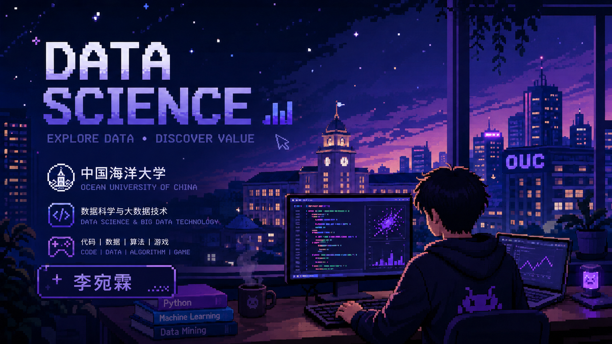
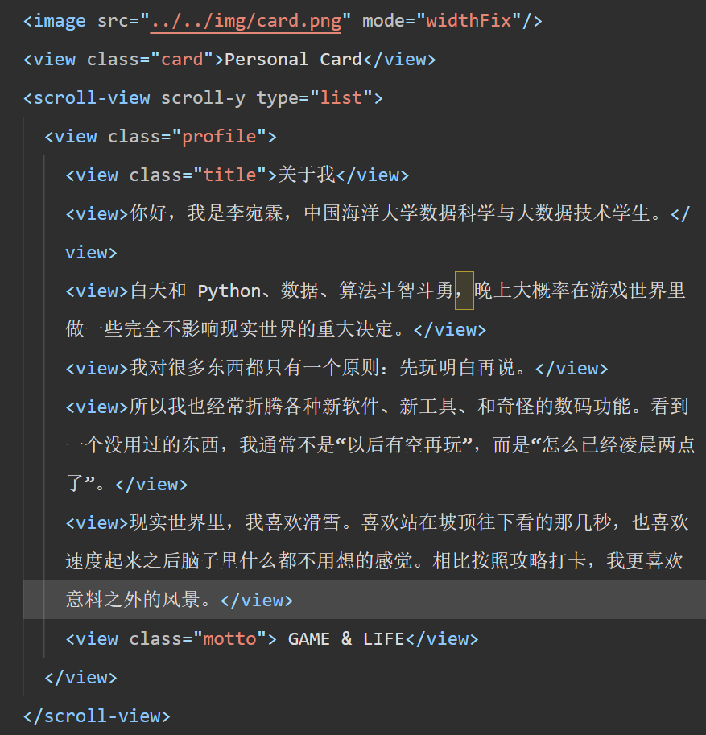
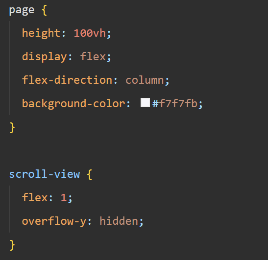
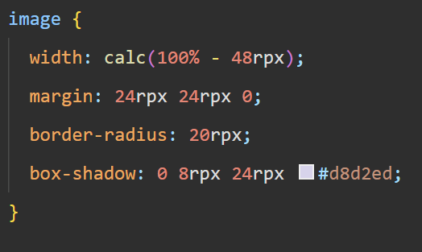
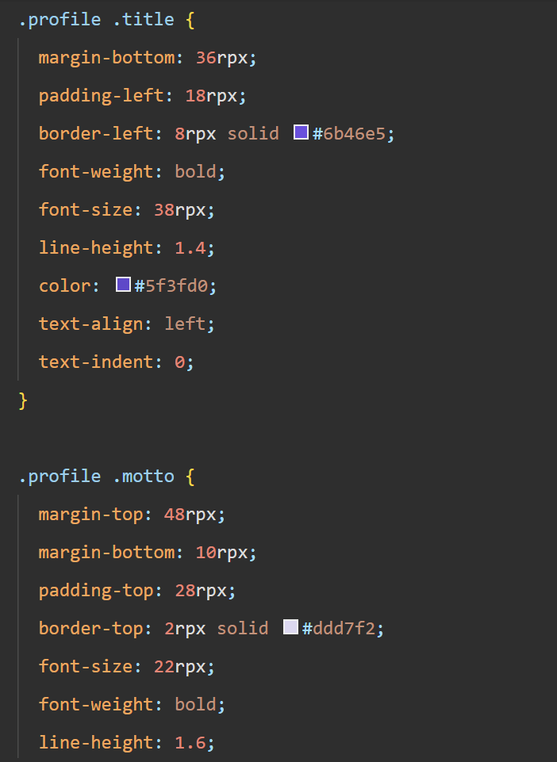
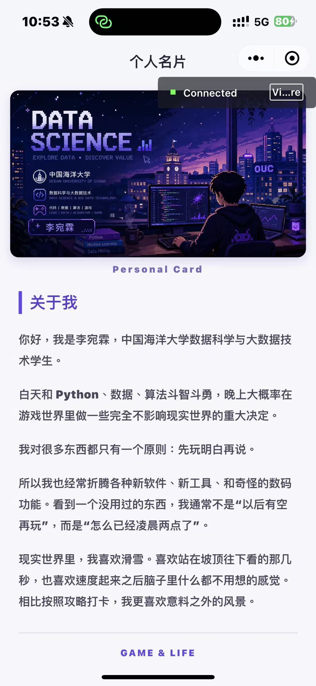

# 2026夏移动软件开发实验二

姓名：李宛霖　　学号：24020007064

| 姓名和学号？ | 李宛霖，24020007064 |
| --- | --- |
| 本实验属于哪门课程？ | 中国海洋大学26夏《移动软件开发》 |
| 实验名称？ | 实验2：名片小程序 |
| 博客地址？ | https://7m7666.github.io/ |
| 代码仓库地址？ | https://github.com/7M7666/Mobile-Development2026 |

<!--more-->

---

## 一、实验内容

### （一）实验目的

这次实验是在微信小程序中制作一张个人名片。页面上半部分使用一张 16:9 的个人头图，下半部分放置个人介绍，并用 WXSS 调整图片、文字和页面间距。实验主要练习 WXML 页面结构和 WXSS 样式，也让我对小程序中 `view`、`image` 和 `scroll-view` 的用法更加熟悉。

### （二）实验过程

#### 1. 准备名片头图

我先根据自己的专业和兴趣制作了一张 16:9 横版头图，图片使用深蓝和紫色的像素风格，内容包括中国海洋大学、数据科学与大数据技术，以及代码、数据、算法和游戏等关键词。完成后将图片保存为 `img/card.png`，供小程序首页使用。

图 1　名片小程序使用的 16:9 头图

#### 2. 用 WXML 安排页面内容

首页继续使用项目自带的导航栏，标题设置为“个人名片”。头图通过 `<image>` 引入，`mode="widthFix"` 可以在图片宽度变化时保持原来的宽高比例。

图片下方是 `Personal Card`，再往下使用 `scroll-view` 放置个人介绍。正文使用多个 `view` 分段，主要包括“关于我”、个人简介、兴趣爱好和最后的 `GAME & LIFE`。

图 2　首页的 WXML 页面结构

这次页面以展示为主，没有按钮或数据切换功能，所以 `index.js` 中只保留了 `Page({})`。

#### 3. 用 WXSS 调整头图和页面颜色

图 3　页面与滚动区域的 WXSS 设置

页面背景使用接近白色的浅紫灰色。头图左右各保留 `24rpx` 的距离，并设置圆角和浅紫色阴影。`rpx` 会根据手机屏幕宽度缩放，比固定的 `px` 更适合小程序在不同设备上显示。

图 4　头图的尺寸、边距、圆角和阴影设置

页面没有加入复杂组件，主要颜色也控制在深灰、浅紫和亮紫几种。这样可以和头图中的蓝紫色保持一致，同时不影响正文阅读。

#### 4. 调整个人介绍的排版

个人介绍的文字较多，如果全部居中，段落两侧会变得参差不齐，阅读时也不容易找到下一行。我把正文改成左对齐，字号设为 `27rpx`，行高设为 `1.85`，段落之间保留 `30rpx` 的距离。

“关于我”使用较大的紫色字体，并通过 `border-left` 增加一条紫色竖线。竖线与文字之间使用 `padding-left` 留出距离。页面最后的 `GAME & LIFE` 居中显示，上方使用浅紫色的 `border-top` 作为分隔线。

图 5　“关于我”标题和 GAME & LIFE 的样式设置

图 6　名片小程序的真机运行效果

### （三）实验结果

| 检查内容 | 实际结果 |
| :--- | :--- |
| 导航栏 | 显示“个人名片” |
| 头图 | 按原比例显示 `img/card.png`，带有圆角和浅紫色阴影 |
| 个人介绍 | 分段显示“关于我”和个人介绍文字 |
| 页面滚动 | 文字超过剩余屏幕高度时可以上下滚动 |
| 页面风格 | 背景、标题、阴影和分隔线使用统一的紫色系 |

---

## 二、问题总结与体会

### （一）实验中遇到的问题

#### 1. 长段落居中后不容易阅读

页面刚加入个人介绍时，我沿用了短文字居中的样式。文字只有一两行时问题不明显，换成长段落后，每行的起止位置不同，整个正文看起来比较乱。

后来我将 `.profile` 的 `text-align` 改为 `left`，并重新调整字号、行高和段落间距。正文改为左对齐后，文字的阅读顺序更清楚。“关于我”和 `GAME & LIFE` 仍然单独设置样式，用来区分标题、正文和结尾。

#### 2. 紫色关键词被拆到单独一行

为了突出姓名和兴趣，我曾在一个 `view` 中嵌套多个 `<text>`，只给部分文字设置紫色。实际运行后，紫色关键词被拆到了单独一行，原来的句子也随之断开。

检查 `app.json` 后发现，项目使用 Skyline 渲染器，并开启了 `defaultDisplayBlock`。在当前设置下，新增的文本节点没有按预期参与行内排版。最后我删除了正文中的嵌套 `<text>`，让每个段落保持完整，只在“关于我”、`Personal Card` 和 `GAME & LIFE` 这些独立元素上使用紫色。这样既保留了页面的主色，也没有破坏正文布局。

#### 3. `px` 和 `rpx` 的选择

开始调整样式时，我对 `px` 和 `rpx` 的区别不太确定。`px` 的尺寸相对固定，`rpx` 会按照屏幕宽度换算。名片页面中的边距、字号、圆角和阴影都需要在不同尺寸的手机上保持接近的比例，因此最终统一使用了 `rpx`。

### （二）实验心得

这次实验没有复杂的 JavaScript，主要工作都在 WXML 和 WXSS 中。做完后我发现，页面内容正确显示只是第一步，文字对齐、行高、间距和颜色也会直接影响使用时的感觉。特别是个人介绍变长以后，原来适合短文字的居中排版就不再合适，需要根据实际内容重新调整。

我现在也知道了，调整页面样式时需要不断在 WXML 和 WXSS 之间切换。WXML 决定页面上有什么内容、它们放在哪一层，WXSS 再根据标签和 class 调整外观。有时改完 WXSS 才会发现 WXML 的结构不方便设置样式，改动 WXML 后又要回到 WXSS 调整。这个过程很难一次写完，我基本都是每次改一两个地方，重新编译看看效果，再继续慢慢修改和调试。

我也学会了用 `border-left` 和 `border-top` 做简单的装饰。它们本质上还是普通边框，但分别放在标题左侧和结尾上方后，就能让页面层次更清楚，不需要额外添加图片或复杂组件。

紫色关键词换行的问题让我注意到，WXML 标签的显示方式还会受到渲染器配置影响。出现排版问题时，除了检查 WXSS，还要看页面使用的组件和 `app.json` 中的设置。对于现在这个名片页面，保持结构简单、只给少量独立元素设置强调色，反而更加稳定。

---

> 作者: 7M7  
> URL: https://7m7666.github.io/posts/2026-summer-mobile-development-experiment-2/  

