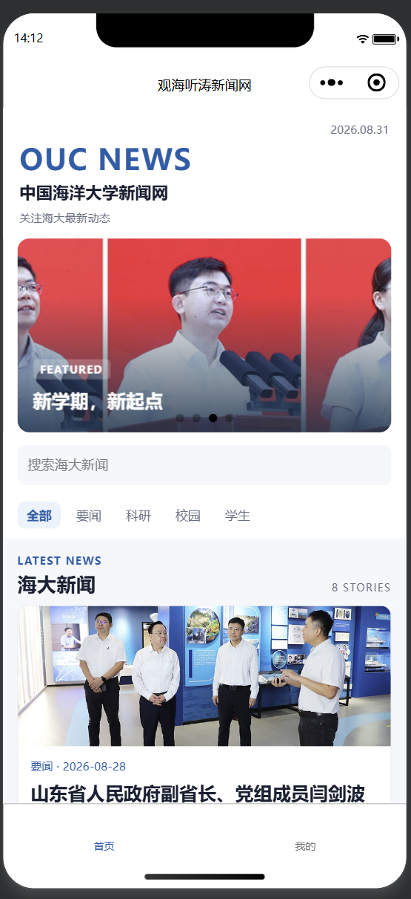
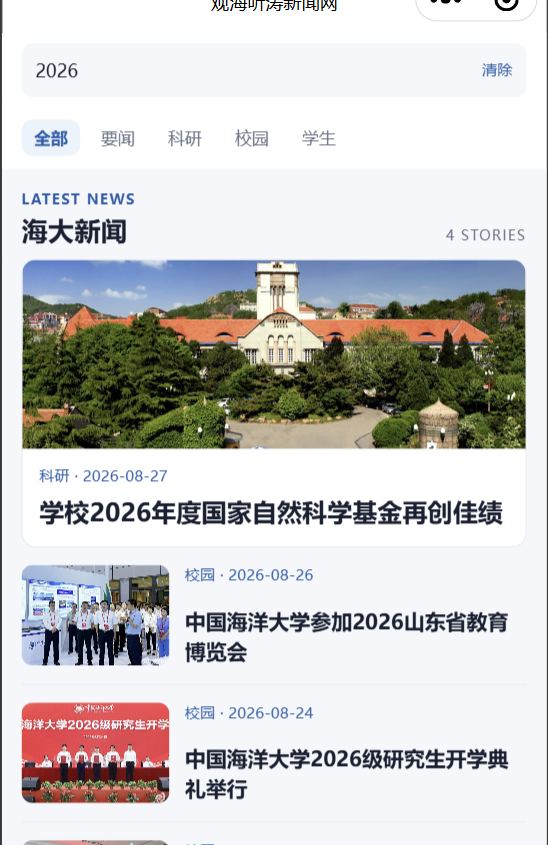
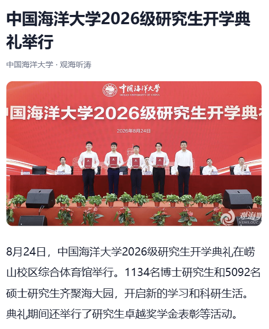
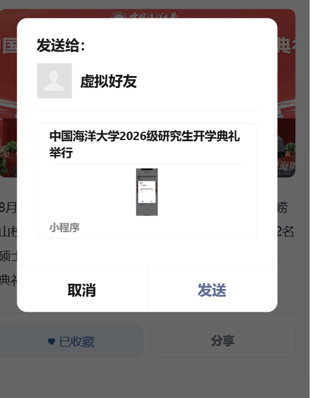
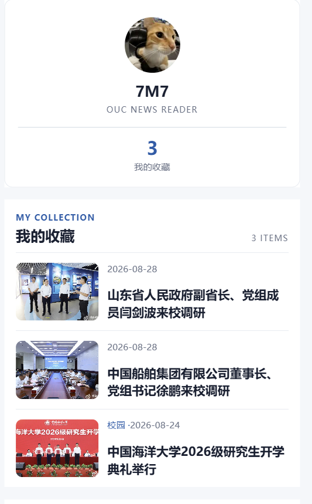
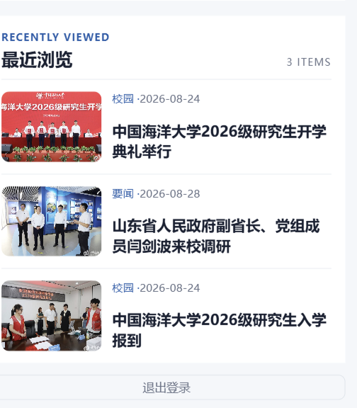

# 2026夏移动软件开发实验三


<div align="center">姓名：李宛霖　　学号：24020007064</div>

| 项目 | 内容 |
| --- | --- |
| 课程 | 中国海洋大学《移动软件开发》 |
| 实验名称 | Lab 3 高校新闻网微信小程序 |
| 项目主题 | 中国海洋大学新闻网 / OUC NEWS |
| 博客地址 | https://7m7666.github.io/ |
| 代码仓库地址 | https://github.com/7M7666/Mobile-Development2026 |

<!--more-->

## 1 实验目的

1. 熟悉原生微信小程序中 `app.json`、页面 JS、WXML 和 WXSS 的分工，能够配置多页面和底部 tabBar。
2. 使用 `require` 导入本地模块，在 `onLoad` 中取得新闻数据，通过 `setData` 传给 WXML 渲染；掌握 `wx:for`、`wx:if` 和 `wx:else` 的用法。
3. 完成新闻列表到新闻详情页的跳转，理解 `data-id`、事件对象 `dataset`、URL 参数和 `options.id` 之间的数据传递关系。
4. 使用 `swiper` 实现自动轮播，使用 Flex 布局实现左图右文的新闻条目和收藏条目。
5. 使用同步本地缓存实现新闻收藏、取消收藏和收藏列表读取，比较页面生命周期 `onLoad` 与 `onShow` 在不同场景下的作用。
6. 结合实际调试信息练习定位模块导入、WXML 标签嵌套、默认模板残留、WXSS 警告和资源包体积等问题。
7. 在保持已有交互逻辑稳定的前提下，使用分类状态、WXML 层级和 WXSS 信息层级改进高校新闻阅读体验。

## 2 实验要求

本实验围绕高校新闻网小程序完成页面组织、新闻展示、新闻详情和个人收藏功能。结合课程 Lab 3 页面要求及当前代码，具体完成内容如下：

1. 配置首页、详情页、我的页面；首页和我的页面作为 tabBar 的一级页面，详情页由新闻条目跳转进入。
2. 以本地 `common.js` 模拟新闻数据，首页显示新闻缩略图、标题和日期；详情页显示完整新闻内容。
3. 使用轮播组件显示至少三张新闻图片，并实现自动循环轮播和轮播图点击跳转。
4. 在详情页将新闻按唯一 key 写入或移出本地 Storage；在“我的”页面读取所有新闻收藏，并支持再次打开详情页。
5. 在“我的”页面完成头像选择、昵称输入、登录状态切换、未填写信息提示和退出登录。
6. 将页面视觉调整为“中国海洋大学新闻网 / OUC NEWS”风格，让首页日期由 JavaScript 在运行时生成，并通过本地分类筛选组织新闻。

## 3 总体设计

### 3.1 页面结构

`app.json` 实际注册了以下三个页面：

```text
pages/index/index     首页：品牌头部、Featured 轮播、分类与分层新闻列表
pages/detail/detail   详情：新闻阅读页、收藏操作
pages/my/my           我的：模拟登录、资料卡和我的收藏
```

其中 tabBar 只配置了 `pages/index/index`（首页）和 `pages/my/my`（我的）。`detail` 是从新闻条目进入的二级页，使用 `wx.navigateTo()` 打开，因此不放在 tabBar 中。导航栏标题当前配置为“观海听涛新闻网”。

### 3.2 数据结构

新闻数据存放在 `utils/common.js` 的 `news` 数组中，当前共有 8 条，日期范围为 2026-08-24 至 2026-08-28。每条新闻包含以下字段：

```js
{
  id: '122579',
  title: '山东省人民政府副省长、党组成员闫剑波来校调研',
  poster: '/images/来校调研.jpg',
  content: '新闻正文……',
  add_date: '2026-08-28',
  category: '要闻'
}
```

模块对外提供 `getNewsList()` 和 `getNewsDetail(newsID)`。前者整理列表页所需的 `id`、`poster`、`add_date`、`title`、`category` 和 `content`；后者根据 id 返回 `{ code, news }`，供详情页使用。当前 8 条新闻的分类数量为：要闻 2 条、科研 2 条、校园 3 条、学生 1 条。

### 3.3 页面数据流

首页列表的数据流为：

```text
utils/common.js 的 news
        ↓ getNewsList()
pages/index/index.js 的 onLoad
        ↓ setData({ newsList, filteredNewsList })
pages/index/index.wxml 的主新闻与普通新闻列表
```

分类筛选的数据流为：

```text
分类文字 data-category
        ↓ bindtap(changeCategory)
e.currentTarget.dataset.category
        ↓ filter()
filteredNewsList
        ↓ setData()
首页重新渲染
```

新闻详情的数据流为：

```text
item.id → data-id → bindtap(goDetail) → e.currentTarget.dataset.id
       → wx.navigateTo('/pages/detail/detail?id=...')
       → detail.js 的 options.id → getNewsDetail(id) → setData({ news })
       → detail.wxml
```

收藏的数据流为：

```text
detail.js 的 news → wx.setStorageSync('news_' + id, news)
                         ↓
my.js 的 onShow → wx.getStorageInfoSync().keys → 筛选 news_ 前缀
                         ↓
wx.getStorageSync(key) → collectList → my.wxml
```

### 3.4 本地数据存储设计

本项目没有后端，收藏和浏览历史都使用同步 Storage，但采用不同结构避免混淆。收藏以新闻 id 为基础分别保存，例如 `news_122579 → 新闻对象`；详情页的 `toggleCollect()` 负责写入或删除该 key。“我的”页面读取所有 key 时只筛选 `news_` 前缀，并明确排除 `news_history`。

最近浏览使用单独的 `news_history` key，其值是新闻对象数组，按最近浏览顺序保存，最多 5 条。虽然它也以 `news_` 开头，但不是收藏新闻；因此排除该 key 是收藏读取与历史记录共存的必要条件。

## 4 实验过程

### 4.1 创建页面与 tabBar

我先在 `app.json` 的 `pages` 数组中注册 index、detail 和 my 三个页面。`pages` 负责告诉小程序有哪些可访问页面；tabBar 只适合放用户可直接切换的一级页面。因此首页和我的页面进入 tabBar，详情页只注册、不加入 tabBar。

关键配置如下：

```json
"pages": [
  "pages/index/index",
  "pages/detail/detail",
  "pages/my/my"
],
"tabBar": {
  "list": [
    { "pagePath": "pages/index/index", "text": "首页" },
    { "pagePath": "pages/my/my", "text": "我的" }
  ]
}
```

这样用户可以在首页和我的之间通过底部栏切换，而点击新闻后再进入详情页，符合页面层级关系。

### 4.2 导入新闻数据

老师提供的新闻模拟数据放在 `utils/common.js` 中。首页 JS 使用相对路径导入模块，并在页面数据中先定义空的 `newsList`：

```js
var common = require('../../utils/common.js')

Page({
  data: { newsList: [] },
  onLoad: function () {
    var list = common.getNewsList()
    this.setData({ newsList: list })
  }
})
```

`require` 的结果是 `common.js` 中 `module.exports` 导出的对象。`data` 是页面的响应式数据来源；`onLoad` 在页面首次加载时执行，因此适合取得初始列表。小程序不能靠直接改 WXML 内容来更新界面，必须调用 `setData` 更新数据层，框架才会把 `newsList` 的新值同步到 WXML。

### 4.3 更新为中国海洋大学新闻

原始示例数据是 2022 年其他高校新闻，不能直接体现本次项目主题。我保留了 `getNewsList()` 和 `getNewsDetail()` 两个函数的接口，只将 `const news = [...]` 中的数据替换为 2026 年中国海洋大学相关新闻，并将新闻图片逐步改为本地路径，例如：

```js
poster: '/images/自然基金科学.jpg',
add_date: '2026-08-27',
category: '科研'
```

图片字段在数据、JS 和 WXML 中的传递关系是 `poster → item.poster → src="{{item.poster}}"`。后期增加的 `category` 也通过 `getNewsList()` 一并提供给首页，用于分类筛选和新闻条目的辅助信息。本地图片不依赖网络请求，便于在开发者工具中直接展示；但后面的真机上传也暴露了图片体积需要控制的问题。

### 4.4 wx:for 实现新闻列表

首页最初使用 `wx:for` 遍历 `newsList`；最终版本保留了完整的 `newsList`，但将当前需要展示的数据改为 `filteredNewsList`。一轮循环中的当前对象默认叫 `item`，普通新闻只渲染循环中 `index > 0` 的项目：

```xml
<block wx:for="{{filteredNewsList}}" wx:key="id">
  <view wx:if="{{index > 0}}"
        class="news-item"
        data-id="{{item.id}}"
        bindtap="goDetail">
  <image class="news-image" src="{{item.poster}}" mode="aspectFill"></image>
  <view class="news-info">
    <text class="news-meta">{{item.category}} · {{item.add_date}}</text>
    <text class="news-title">{{item.title}}</text>
  </view>
  </view>
</block>
```

`wx:for="{{filteredNewsList}}"` 表示按当前筛选结果逐项生成新闻条目，`{{item.title}}` 等写法读取当前新闻字段。`wx:key="id"` 以新闻 id 作为稳定标识，便于框架在列表更新时识别每个节点。新闻条目的 `data-id` 还为下一步跳转保存了当前新闻编号。第 0 项交给主新闻卡片显示，循环中的 `wx:if="{{index > 0}}"` 避免它在普通列表中重复出现。

### 4.5 Flex 布局

早期列表只是纵向堆叠，新闻阅读不够紧凑。最终的普通新闻条目使用 Flex 容器，使缩略图和文字并排；右侧文字区再使用纵向 Flex，让分类日期在上、标题在下：

```css
.news-item {
  display: flex;
  padding: 26rpx 0;
  border-bottom: 1rpx solid #e5eaf0;
}
.news-info {
  flex: 1;
  min-width: 0;
  margin-left: 22rpx;
  display: flex;
  flex-direction: column;
  justify-content: space-between;
}
```

`display: flex` 让子元素沿主轴排列，默认横向，所以图片和文字形成“左图右文”。`.news-info` 的 `flex: 1` 占用图片以外的剩余宽度；`flex-direction: column` 改为纵向布局，`justify-content: space-between` 将分类日期和标题分散到上下两端。`min-width: 0` 配合两行标题截断，防止长标题在 Flex 容器中撑破布局。收藏列表复用了相同的布局思路。

### 4.6 Swiper 轮播

首页 `data` 中定义了实际含 4 项的 `bannerList`，每一项是带 `id`、`image` 和 `title` 的对象，不再只是图片字符串。这样轮播图可以同时显示图片和标题，也能按 id 进入对应详情。

```xml
<swiper class="banner" indicator-dots="true"
        autoplay="true" interval="3000" circular="true">
  <swiper-item wx:for="{{bannerList}}" wx:key="image"
               data-id="{{item.id}}" bindtap="goDetail">
    <view class="banner-item">
      <image class="banner-image" src="{{item.image}}" mode="aspectFill"></image>
      <view class="banner-mask"></view>
      <view class="banner-content">
        <text class="featured-tag">FEATURED</text>
        <text class="banner-title">{{item.title}}</text>
      </view>
    </view>
  </swiper-item>
</swiper>
```

`indicator-dots` 显示页码圆点，`autoplay` 开启自动播放，`interval="3000"` 表示每 3 秒切换一次，`circular` 表示从最后一张可继续回到第一张。最终轮播图高度为 `360rpx`，左右保留 `28rpx` 边距并使用 `24rpx` 圆角。图片的 `aspectFill` 会填满轮播区域，可能裁掉边缘但不会拉伸；轮播图片顺序也调整为先显示文字较少的现场图片，减轻图片自身文字与覆盖标题的冲突。

轮播项父容器设置 `position: relative`，它成为叠放元素的定位参考；遮罩和文字区域使用 `position: absolute` 覆盖在图片上。遮罩使用 `linear-gradient` 让图片底部逐渐变暗，而不是添加一块固定黑色矩形，因此白色 `FEATURED` 标签和标题在不同图片上都有较好的可读性。

### 4.7 新闻详情跳转

新闻列表与轮播图都绑定同一个 `goDetail` 方法。事件发生时，`currentTarget` 是绑定 `bindtap` 的条目节点，读取它的 `dataset.id` 就能取到 WXML 中的 `data-id`：

```js
goDetail: function (e) {
  var id = e.currentTarget.dataset.id
  wx.navigateTo({
    url: '/pages/detail/detail?id=' + id
  })
}
```

整条链路是：`item.id` 写入 `data-id`，点击触发 `bindtap`，事件对象 `e` 的 `currentTarget.dataset.id` 取值，然后拼入 `navigateTo` 的 URL。详情页加载时收到的 URL 查询参数会形成 `options` 对象，因此可以从 `options.id` 获得同一个新闻 id。

### 4.8 详情页数据读取

详情页同样导入 `common.js`。它不依赖首页临时变量，而是在自身的 `onLoad` 中根据参数重新查询新闻，这样无论从首页还是收藏页进入，都能按 id 得到同一条内容：

```js
onLoad: function (options) {
  var id = options.id
  var result = common.getNewsDetail(id)
  if (result.code === '200') {
    this.saveHistory(result.news)
  }
  var key = 'news_' + id
  var saved = wx.getStorageSync(key)
  this.setData({
    news: result.news,
    isCollected: !!saved
  })
}
```

`getNewsDetail(id)` 返回的不是新闻对象本身，而是 `{ code: '200', news: {...} }` 结构，所以需要写入 `result.news`。成功获取新闻后会调用 `saveHistory(result.news)` 记录最近浏览，详细逻辑见 4.19。最终 WXML 在顶部条件显示 `{{news.category}} ·`，再绑定 `{{news.add_date}}`、`{{news.title}}`、`{{news.poster}}` 和 `{{news.content}}`。分类为空时只显示日期，不会影响页面；标题下方固定显示“中国海洋大学 · 观海听涛”作为站点来源信息。

### 4.9 收藏与取消收藏

详情页的 `isCollected` 初始为 `false`。加载新闻时，以 `news_` 和新闻 id 组合出 key，例如 `news_122579`；`wx.getStorageSync(key)` 读到已保存对象时，`!!saved` 将对象转换为布尔值 `true`，没有数据时为 `false`。

```js
var key = 'news_' + news.id
if (this.data.isCollected) {
  wx.removeStorageSync(key)
  this.setData({ isCollected: false })
} else {
  wx.setStorageSync(key, news)
  this.setData({ isCollected: true })
}
```

Storage 是本地 key-value 缓存。使用新闻 id 组成 key，避免不同新闻互相覆盖，也能让再次打开同一条新闻时按同一个 key 判断收藏状态。按钮文案使用 WXML 三元表达式切换：

```xml
{{isCollected ? '♥ 已收藏' : '♡ 收藏本文'}}
```

点击收藏时存储整条新闻并立即更新 `isCollected`；点击已收藏状态时移除该 key 并更新状态。因此在未清除本地缓存的前提下，再次进入详情页仍能保持收藏状态。最终收藏操作改为带 `bindtap="toggleCollect"` 的轻量 `view`，通过边框、浅蓝背景和文字状态表达收藏状态，避免使用默认大按钮，但没有改动 Storage 业务逻辑。

### 4.10 我的收藏

“我的”页面需要从 Storage 中找出所有收藏新闻。当前实现先通过 `wx.getStorageInfoSync()` 取得全部 key，再只处理以 `news_` 开头的 key，避免把快速启动模板留下的 `logs` 等无关缓存当作新闻：

```js
onShow: function () {
  var info = wx.getStorageInfoSync()
  var keys = info.keys
  var list = []
  for (var i = 0; i < keys.length; i++) {
    if (keys[i].indexOf('news_') === 0 &&
        keys[i] !== 'news_history') {
      var news = wx.getStorageSync(keys[i])
      if (news) list.push(news)
    }
  }
  var history = wx.getStorageSync('news_history') || []
  this.setData({
    collectList: list,
    historyList: history
  })
}
```

`indexOf('news_') === 0` 表示前缀必须从字符串第 0 位开始。新增历史后，`news_history` 也满足这一条件，所以必须额外排除它，避免把整个历史数组错误地加入收藏列表。读出的新闻对象加入 `list`，再由 `collectList` 循环渲染；`historyList` 同时读取最近浏览数组。收藏与历史条目都保留 `data-id` 和 `bindtap="goDetail"`，点击后仍通过 URL 参数回到详情页。

这里用 `onShow` 而不只用 `onLoad` 很关键：用户可能先进入“我的”，返回首页收藏新闻，然后再次切到“我的”。页面此前已经创建过，`onLoad` 不会再次执行；而每次页面重新显示都会执行 `onShow`，因此收藏数量和列表会重新读取。

### 4.11 用户信息及登录状态

本页面的用户信息只保存在页面 `data` 中，用来模拟前端交互。未登录时允许选择头像和输入昵称；头像按钮使用 `open-type="chooseAvatar"`，回调中从 `e.detail.avatarUrl` 读取图片路径；昵称输入框使用 `type="nickname"`，从 `e.detail.value` 读取内容。

```js
onChooseAvatar: function (e) {
  this.setData({ 'userInfo.avatarUrl': e.detail.avatarUrl })
},
onInputChange: function (e) {
  this.setData({ 'userInfo.nickName': e.detail.value })
},
login: function () {
  var userInfo = this.data.userInfo
  if (!userInfo.avatarUrl || !userInfo.nickName) {
    wx.showToast({ title: '请完善头像和昵称', icon: 'none' })
    return
  }
  this.setData({ hasUserInfo: true })
}
```

`hasUserInfo` 决定界面状态。WXML 中 `wx:if="{{!hasUserInfo}}"` 显示居中的头像入口、欢迎文案、昵称输入和登录操作，紧跟的同级 `wx:else` 显示资料卡；收藏区域额外用 `wx:if="{{hasUserInfo}}"` 限制为登录后显示。资料卡显示头像、昵称、`OUC NEWS READER` 和 `collectList.length`；退出登录被放在收藏区域后方，避免抢占资料卡的视觉中心。退出时把 `hasUserInfo` 改为 `false`，并清空当前页面的头像和昵称。由于没有后端或用户信息持久化，这一登录状态不会跨重新启动小程序保存。

### 4.12 首页 OUC NEWS 视觉完善与自动日期

在保留新闻列表功能的基础上，我将首页改为 OUC NEWS 品牌头部：最明显的文字为“OUC NEWS”，下方是“中国海洋大学新闻网”和“关注海大最新动态”，日期放在右上角。导航栏本身已经显示“观海听涛新闻网”，因此最终首页没有重复显示“观海听涛”。新闻分区显示为“海大新闻 / LATEST NEWS”。日期不是在 WXML 中写死，而是在 `onLoad` 通过 `Date` 生成：

```js
var today = new Date()
var month = today.getMonth() + 1
var day = today.getDate()
if (month < 10) month = '0' + month
if (day < 10) day = '0' + day
var date = today.getFullYear() + '.' + month + '.' + day
this.setData({ currentDate: date })
```

`getMonth()` 的取值从 0 开始，所以必须加 1。个位数月份和日期补零后，格式保持为 `YYYY.MM.DD`，例如运行当天为 2026 年 8 月 31 日时显示 `2026.08.31`。WXML 读取 `{{currentDate}}`。当前首页没有单独的“观海听涛”文字，该文字实际配置为全局导航栏标题“观海听涛新闻网”。

### 4.13 后期视觉优化与轻量功能增强

在核心功能完成后，页面已经能够展示新闻、跳转详情、收藏并读取收藏列表。但继续检查展示效果时发现，首页信息层级较平，轮播接近默认组件，所有新闻条目样式相同；详情页阅读层级较弱，“我的”页面也偏向默认表单布局。因此我没有重新实现已经稳定的 JS 逻辑，而是在保留页面路径、`goDetail()`、`toggleCollect()`、Storage 和 `onShow()` 的前提下，对页面结构和样式进行第二阶段优化，并只为分类筛选补充了必要的数据字段。

### 4.14 新闻分类筛选

分类是后期新增的主要交互之一。新闻对象增加 `category`，取值限定为“要闻、科研、校园、学生”。首页 `data` 中保留完整的 `newsList`，另外新增 `categories`、`currentCategory`、`searchKeyword` 和 `filteredNewsList`：

```js
categories: ['全部', '要闻', '科研', '校园', '学生'],
currentCategory: '全部',
searchKeyword: '',
filteredNewsList: []
```

分类文字将当前项写入 `data-category`；点击后从事件对象取得分类，只更新 `currentCategory`，再调用统一筛选函数。这样分类和搜索不会分别维护两套逻辑：

```js
changeCategory: function (e) {
  var category = e.currentTarget.dataset.category
  this.setData({
    currentCategory: category
  }, () => {
    this.applyFilters()
  })
}
```

这样 `newsList` 始终保留 8 条原始列表数据，`filteredNewsList` 只负责当前界面展示；切回“全部”时无需再次读取 `common.js`。没有搜索关键词时，“全部、要闻、科研、校园、学生”分别显示 8、2、2、3、1 条新闻。当前分类通过海大蓝文字和浅蓝背景区分，未选中项保持浅灰文字。

### 4.15 首页视觉重构与新闻分层展示

最终首页结构如下：

```text
首页
├─ Header：OUC NEWS、中文站名、副标题、当前日期
├─ Featured Swiper
├─ 新闻分类：全部、要闻、科研、校园、学生
└─ Latest News
   ├─ 第 1 条筛选结果：主新闻卡片
   └─ 其余结果：紧凑新闻列表
```

主新闻卡片只在 `filteredNewsList.length > 0` 时渲染，并直接绑定 `filteredNewsList[0]`。图片高度为 `260rpx`，下方显示分类、日期和大标题。普通列表在循环中以 `wx:if="{{index > 0}}"` 显示，因此第一条不会重复。空结果时显示“暂无相关新闻”。这种区分不是增加新的新闻业务，而是让首条新闻承担视觉焦点，后续条目保持较高的信息密度。

### 4.16 Detail 新闻阅读页优化

详情页的 JS 没有重写，仍按 `options.id → getNewsDetail(id) → result.news → setData()` 获取新闻，收藏仍使用原有同步 Storage。变化主要发生在 `detail.wxml` 与 `detail.wxss`：页面按“分类日期—标题—来源—主图—正文—分割线—收藏操作”排列；标题使用更大的字号和更宽的行距，正文使用 `30rpx` 字号与 `56rpx` 行高，主图使用 `390rpx` 高和轻微圆角。

这次调整让我体会到业务逻辑和表现层可以相对分离：数据读取、收藏状态和事件函数已经稳定时，主要修改 WXML 与 WXSS 就能将原来的详情展示整理成新闻阅读页，而不需要重新实现 JS。

### 4.17 My 页面视觉优化

“我的”页也保留原来的头像选择、昵称输入、登录、退出、收藏读取和收藏跳转逻辑。未登录时，`chooseAvatar` 按钮被设计为圆形头像入口；未选择头像显示“+ / ADD PHOTO”，选择后显示真实头像，下面依次是欢迎文案、说明、昵称输入和登录操作。已登录时，`wx:else` 分支显示白色资料卡，包括头像、昵称、`OUC NEWS READER`、收藏数量和“我的收藏”。

收藏区域使用“MY COLLECTION / 我的收藏 / N ITEMS”标题，条目仍按 `data-id` 和 `bindtap="goDetail"` 进入详情。若旧的 Storage 缓存没有 `category`，WXML 通过 `wx:if="{{item.category}}"` 只显示日期，避免出现异常。无收藏时显示“暂无收藏”和引导文字；退出登录放在页面较下方的轻量操作区。

### 4.18 新闻关键词搜索

首页在 Featured 轮播图与分类栏之间增加本地搜索框，输入框绑定 `onSearchInput`，占位文字为“搜索海大新闻”。`getNewsList()` 额外返回 `content`，因此关键词不仅可匹配 `title`，也可匹配新闻正文。输入时保存 `searchKeyword`，点击“清除”时置为空，二者都调用 `applyFilters()`：

```js
applyFilters: function () {
  var list = this.data.newsList
  var category = this.data.currentCategory
  var keyword = this.data.searchKeyword.trim().toLowerCase()

  if (category !== '全部') {
    list = list.filter(function (item) {
      return item.category === category
    })
  }
  if (keyword) {
    list = list.filter(function (item) {
      return item.title.toLowerCase().indexOf(keyword) !== -1 ||
        item.content.toLowerCase().indexOf(keyword) !== -1
    })
  }
  this.setData({ filteredNewsList: list })
}
```

这里的顺序体现了“分类条件 AND 搜索关键词”的关系。例如当前分类为“科研”时搜索“海洋”，结果必须同时属于科研类，并且标题或正文含有“海洋”。把两种条件集中到 `applyFilters()` 中，可以避免分类函数和搜索函数各写一套筛选逻辑而产生状态不一致。没有匹配结果时，页面显示“未找到相关新闻”和“换个关键词试试”。

### 4.19 最近浏览

用户真正进入详情页后，`detail.js` 在成功取得 `result.news` 时调用 `saveHistory(news)`。历史不为每条新闻建立独立 key，而是统一保存到 `news_history` 数组，最新浏览的新闻放在最前面：

```js
var history = wx.getStorageSync('news_history') || []
var list = []
for (var i = 0; i < history.length; i++) {
  if (history[i].id !== news.id) {
    list.push(history[i])
  }
}
list.unshift(news)
wx.setStorageSync('news_history', list.slice(0, 5))
```

这段代码先删除同 id 的旧项，再将当前新闻放到开头，最后 `slice(0, 5)` 限制数量。因此浏览顺序为 A → B → C → A 时，结果是 A、C、B，而不会出现两个 A。“我的”页面在 `onShow` 中读取 `historyList`，用紧凑新闻列表显示“RECENTLY VIEWED / 最近浏览”；空列表时显示“暂无浏览记录”。

收藏使用 `news_ + id`，历史使用 `news_history`，两种 Storage 结构相互独立。由于 `news_history` 同样以 `news_` 开头，收藏遍历 key 时增加 `keys[i] !== 'news_history'` 判断，避免把历史数组当作收藏新闻。这是增加 Storage 数据时需要同时检查旧筛选规则的一个例子。

### 4.20 新闻分享

详情页在收藏操作旁保留一个原生分享按钮：

```xml
<button class="share-btn" open-type="share">分享</button>
```

`open-type="share"` 由微信小程序触发分享面板，页面的 `onShareAppMessage()` 返回当前新闻的真实标题和带 id 的详情页路径：

```js
onShareAppMessage: function () {
  var news = this.data.news
  return {
    title: news.title,
    path: '/pages/detail/detail?id=' + news.id
  }
}
```

分享路径必须保留 `?id=`；接收者从分享卡片进入后，详情页才能通过 `options.id` 查询到正确新闻。项目未配置额外 `imageUrl`，避免增加资源。开发者工具的“发送给虚拟好友”属于模拟分享环境，不等同于真机分享验证。

## 5 调试过程中遇到的问题及解决方法

### 5.1 common.js 模块无法加载

**现象：** 控制台曾提示 `module 'utils/common.js' is not defined`，同时显示 `require args is '../../utils/common.js'`。

**原因分析：** 看到模块无法加载时，最容易先怀疑路径。相对路径是否正确取决于执行 `require` 的 JS 文件位置，而不是项目根目录位置。

**排查过程：** 检查目录后确认 `pages/` 和 `utils/` 同在项目根目录下，`index.js` 位于 `pages/index/index.js`。从该文件返回两层到根目录，再进入 `utils/common.js`，对应的路径正是 `../../utils/common.js`。因此继续检查 `common.js` 文件自身和导出部分。

**解决方法：** 保持正确的相对路径，并确认模块文件存在且使用 `module.exports` 导出函数。相对路径规则是：`..` 返回上一级目录；从 `pages/index/` 连续返回两次才能到项目根目录。

**学到的内容：** 模块错误不能只按报错文字判断为路径错，要同时核对调用文件位置、目标文件位置和导出结果。

### 5.2 `common.getNewsList is not a function`

**现象：** 模块导入后又出现 `TypeError: common.getNewsList is not a function`。

**原因分析：** `require` 不一定报错，但它返回的对象可能不含预期函数。排查中曾把函数名写成 `getNewList()`；而老师提供的真实函数名是 `getNewsList()`。

**排查过程：** 使用 `console.log(common)` 查看导入对象中实际有哪些成员，随后核对 `common.js` 中函数声明与导出对象。

**解决方法：** 统一使用准确的函数名，并在模块末尾正确导出：

```js
module.exports = {
  getNewsList: getNewsList,
  getNewsDetail: getNewsDetail
}
```

**学到的内容：** 函数调用名必须与 `module.exports` 中的属性名完全一致。导入成功和导入到正确接口是两件事。

### 5.3 页面显示“请使用2.10.4及以上版本基础库”

**现象：** 页面曾显示“请使用2.10.4及以上版本基础库”，但项目实际使用的基础库已是 3.17.x。

**原因分析：** 这段文字并不是当前基础库版本检查的结果，而是微信开发者工具默认首页模板中 `wx:else` 的静态文字。

**排查过程：** 在 `index.wxml` 中追踪这段文字的来源，发现已经重写 `index.js`，但旧的默认 WXML 模板还没有完全替换，因此页面仍可能渲染旧分支。

**解决方法：** 删除默认 `index.wxml` 内容，重新编写新闻网的轮播和新闻列表结构。

**学到的内容：** 页面看到提示文字不代表提示本身就是真实原因。应先在代码中追踪文字来自哪里，再判断问题发生在配置、逻辑还是遗留模板。

### 5.4 WXSS 选择器警告

**现象：** 编译时出现类似 `Some selectors are not allowed in component wxss` 的 WXSS 警告。

**原因分析：** 当时 `index.wxss` 中还残留快速启动模板样式，其中含有不适合当前组件样式范围的选择器。

**排查过程：** 根据控制台提示的文件和行号检查 `index.wxss`，而不是只检查 JS Console。

**解决方法：** 清理默认样式，页面样式改为 `.news-list`、`.news-item`、`.news-image` 等 class 选择器，和当前 WXML 的 class 对应。

**学到的内容：** 样式警告也应按具体文件和行号定位；JS、WXML 和 WXSS 的问题要在各自的报错位置排查。

### 5.5 跳转后只看到 `pages/detail/detail.wxml`

**现象：** 点击新闻后页面显示 `pages/detail/detail.wxml`。

**原因分析：** `navigateTo` 已经把页面切换到详情页，只是 `detail.wxml` 当时仍为工具自动生成的占位内容，尚未绑定新闻数据。

**排查过程：** 先检查跳转 URL 是否带有 id；确认进入详情页后，再分别检查 `detail.js` 是否从 `options.id` 查询数据、WXML 是否使用 `news` 字段。

**解决方法：** 在 `detail.js` 中调用 `common.getNewsDetail(id)`，并通过 `setData({ news: result.news })` 传给详情 WXML，再绑定标题、日期、图片和正文。

**学到的内容：** 跳转成功和详情内容完成是两个阶段。页面路径已出现，说明路由基本正确；内容缺失还需要检查该页面的数据加载和模板绑定。

### 5.6 my.wxml 标签结构错误

**现象：** 编译报错：`[ WXML 文件编译错误]`、`get tag end without start, near </>`，定位到 `pages/my/my.wxml` 第 75 行附近的 `</view>`。

**原因分析：** 手动调整未登录、已登录和收藏区域时，`wx:if / wx:else` 的 view 嵌套关系被写乱，出现多余 `</view>`；中间还曾重复写了 `<view wx:else class="user-info">`。

**排查过程：** 不再只从报错行向上猜测，而是先重新画出页面层级：

```text
my-page
├─ user-area
│  ├─ wx:if：未登录
│  └─ wx:else：已登录
└─ collect-area（wx:if：hasUserInfo）
```

然后逐层核对每个 `<view>` 的开始和结束标签，并确认 `wx:if` 与 `wx:else` 是相邻的同级兄弟节点。

**解决方法：** 按上述层级重新整理 `my.wxml`，删除重复的 `wx:else` 和额外闭合标签。

**学到的内容：** WXML 的条件渲染不仅要求条件正确，标签层级也必须完整。结构复杂时先画层级图比直接反复删改标签更可靠。

### 5.7 `chooseAvatar:fail cancel`

**现象：** 调试时出现 `<button>: chooseAvatar:fail cancel`。

**原因分析：** 这是用户打开头像选择器后主动取消操作产生的结果，而不是 `bindchooseavatar` 的程序逻辑异常。

**排查过程：** 对照出现信息时的操作，确认是在头像选择面板点击取消后产生，并且没有导致页面后续逻辑崩溃。

**解决方法：** 不修改功能代码；取消后保持当前未登录状态即可。

**学到的内容：** 调试时需要区分真正的异常和用户取消、拒绝授权等交互结果，不能看到 `fail` 就盲目改代码。

### 5.8 真机调试源码包超过 2 MB

**现象：** 真机调试上传报错 `80051`：`source size 6886KB exceed max limit 2MB`。

**原因分析：** 为了替换成真实海大新闻，`images/` 中放入了多张较大的 JPG。处理前 13 张图片原始文件合计约 6.38 MB，项目目录约 6.41 MB，已经明显高于 2 MB 限制；开发者工具打包显示的 6886 KB 与这一情况相符。

**排查过程：** 将问题从 JS/WXML 功能错误中分离出来，检查 `images/` 文件大小和源码引用。确认 `中国船舶2.jpg`、`中国船舶3.jpg` 没有被任何代码引用；其余 11 张均由 `common.js` 的 `poster` 或首页 `bannerList` 引用。原图先完整备份到项目目录外的 `experiments/experiment-03/image_backup`，保证备份不会被打进上传包。

**解决方法：** 将两张未使用图片移出 `project/images`，对 11 张实际使用的 JPG 使用 Pillow 进行 EXIF 方向校正、RGB 保存、高质量缩放和 JPEG quality 72 压缩。普通新闻图最大宽度控制为 850px，轮播图保持约 1000px；所有文件名和代码路径保持不变。处理后 `images` 目录为 11 张、约 989.6 KB，整个 `project` 目录约 1020.3 KB（约 0.996 MB），已低于 2 MB 限制；最大单张为 `研究生开学1.jpg`，约 171.6 KB。当前只完成了源码体积处理和文件引用检查，尚未在微信开发者工具中重新完成真机上传验证。

**学到的内容：** 小程序能在开发者工具中运行不代表一定能上传。除了代码逻辑，图片等静态资源体积也是提交前必须检查的内容；压缩资源时需要先备份、保留文件名，并重新检查每个引用路径是否仍然存在。

## 6 实验结果

根据当前仓库的代码，开发者工具中的主要功能实现情况如下：

| 功能 | 当前实际状态 |
| --- | --- |
| 首页 | 已配置 OUC NEWS 品牌头部、运行时日期、4 张 Featured 轮播图、分类筛选、主新闻卡片和紧凑新闻列表 |
| 分类筛选 | 默认“全部”显示 8 条新闻；要闻、科研、校园、学生分别显示 2、2、3、1 条新闻 |
| 新闻搜索 | 可按标题和正文实时搜索；与当前分类共同作用，并支持清除关键词 |
| 详情页 | 已按 URL 中的 id 查询并显示分类、日期、标题、来源、图片、正文和收藏状态 |
| 页面跳转 | 首页列表和轮播图均可向详情页传递新闻 id；收藏列表也可再次打开详情 |
| 收藏 | 已使用 `news_ + id` 的本地 Storage key 实现收藏、取消和再次进入状态读取；详情页以“♡ 收藏本文 / ♥ 已收藏”显示状态 |
| 最近浏览 | 详情页进入后写入 `news_history`，按最近顺序去重并最多保留 5 条；“我的”页在 `onShow` 中读取 |
| 新闻分享 | 详情页提供原生分享按钮，分享标题使用新闻标题，路径携带新闻 id |
| 个人中心 | 已有圆形头像入口、昵称输入、信息未填提示、模拟登录、资料卡、退出、收藏数量和最近浏览显示 |
| 数据刷新 | 使用 `onShow` 每次进入“我的”时重新读取收藏和最近浏览 Storage |
| 资源体积 | 已移除 2 张未使用图片并压缩实际使用图片；项目目录实测约 0.996 MB，但尚未重新进行真机上传验证 |

<p align="center"></p>
<p align="center">图 1　OUC NEWS 首页默认界面，包含品牌头部、Featured 轮播、搜索框、分类栏和主新闻卡片。</p>

<p align="center"></p>
<p align="center">图 2　在搜索框输入“2026”后的首页结果，列表显示 4 条匹配新闻。</p>

<p align="center"></p>
<p align="center">图 3　首页 Featured 轮播切换到“海大回迎来2026级研究生”新闻。</p>

<p align="center"></p>
<p align="center">图 4　“中国海洋大学2026级研究生开学典礼举行”新闻详情阅读页。</p>

<p align="center"></p>
<p align="center">图 5　详情页点击分享后弹出的微信原生分享面板，背景中可见已收藏和分享操作区。</p>

<p align="center"></p>
<p align="center">图 6　已登录状态下的个人中心，展示头像昵称和 3 条我的收藏。</p>

<p align="center"></p>
<p align="center">图 7　个人中心的最近浏览列表，当前显示 3 条已浏览新闻和退出登录入口。</p>

因此，本项目的页面、数据绑定、搜索、分类、跳转、本地收藏、最近浏览与分享逻辑已经在当前代码中完成。资源体积已处理至微信上传限制以内，但不能据此写成“真机调试通过”：仍需在微信开发者工具中重新上传或真机调试，确认实际打包结果。

## 7 实验总结

这次实验让我把小程序中数据层、逻辑层和表现层的关系串了起来。`common.js` 可以作为简单的数据层；JS 中的 `data`、事件函数和生命周期负责状态与交互；WXML 决定结构并使用 `{{ }}` 绑定数据；WXSS 负责页面的颜色、留白、字体和布局。JS 中的 `data` 不是直接显示在界面上的内容，必须通过 `setData` 更新，WXML 才会重新渲染。`wx:for` 里的 `item` 是当前循环项，所以列表中的标题、图片和日期都要从 `item` 读取，并用 `wx:key` 指定稳定的新闻 id。

新闻详情跳转是本实验中最清楚的一条数据链：新闻的 `item.id` 写进 `data-id`，点击事件从 `dataset.id` 取出，再拼进 `navigateTo` 的 URL，详情页最后从 `options.id` 得到它。以前只知道页面能跳转，这次明确了参数究竟在什么时候、以什么形式传过去。

`common.js` 让我理解了小程序本地模块的基本用法。模块路径正确还不够，函数名称还要和 `module.exports` 中的属性名一致。出现 `is not a function` 时，打印 `require` 的结果再检查导出，比直接反复改路径更有效。

收藏部分让我理解了 key-value 缓存的思路。用 `news_ + id` 作为 key，可以让每条新闻有独立位置，也便于“我的”页面通过前缀筛选出收藏。`onLoad` 只适合页面第一次创建时加载初始数据，而“我的”页面的收藏会在其他页面发生变化，所以要用 `onShow` 重新读取。后来加入最近浏览后，我把它设计为单独的 `news_history` 数组，并在收藏筛选时排除同样以 `news_` 开头的历史 key，避免不同 Storage 结构相互干扰。

后期加入分类时，我没有在筛选后直接覆盖原始新闻列表，而是保留 `newsList`，使用 `filteredNewsList` 专门保存当前展示结果。这样“全部”分类可直接恢复完整数据，不需要重新读取模块。首页的主新闻卡片和普通新闻列表也让我看到，信息层级不只靠换颜色，还和字号、图片尺寸、留白以及主次结构有关。

搜索功能进一步说明了统一状态处理的必要性。分类和关键词都通过 `applyFilters()` 处理，筛选条件自然组合为“分类 AND 关键词”，不用在两个事件函数中复制过滤代码。分享功能则让我注意到，分享路径不能只写详情页地址，必须把新闻 id 带入 URL，接收者进入页面后才能继续复用原来的 `options.id` 和 `getNewsDetail()`。

后期优化没有推翻已有功能：页面跳转继续复用 `goDetail()`，收藏继续复用 `toggleCollect()` 和 Storage，“我的”页继续在 `onShow()` 读取收藏。由于核心 JS 逻辑稳定，主要通过 WXML 和 WXSS 调整页面结构与视觉表现，再只为分类增加 `category` 字段，能降低引入新错误的风险。

调试过程中，WXML 的 `wx:if / wx:else` 嵌套错误和默认模板残留都说明，页面提示不一定直接指出根因。应该结合报错中的文件和行号，检查标签层级、文字来源和数据绑定位置。真机上传超限也提醒我，完成代码功能后还要检查资源体积；图片在电脑上看起来正常，并不表示可以直接装进小程序源码包。通过先备份原图、清理未使用资源、压缩并重新核对引用路径，项目目录已降到 2 MB 以下；不过最后是否能真机上传仍要以开发者工具的实际结果为准。

## 8 不足之处

1. 最近浏览目前只能在个人中心自动记录和展示，没有提供清空全部记录或删除单条记录的操作。使用一段时间后，用户无法自行整理浏览列表。
2. 当前“登录”只用于前端页面的头像、昵称和登录状态模拟，没有接入真实的微信账号信息或后端用户系统。因此项目不支持切换微信账号，重新进入小程序后也不能按真实账号恢复用户资料。
3. 新闻内容和图片仍来自本地 `common.js` 与本地资源，不能自动获取学校新闻网站的最新信息。后续如果接入接口，还需要考虑网络请求、加载状态和请求失败的处理。


---

> 作者: 7M7  
> URL: https://7m7666.github.io/posts/2026-summer-mobile-development-experiment-3/  

