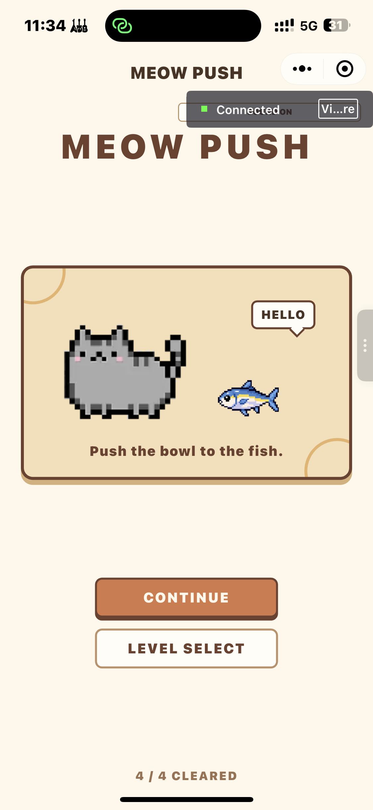
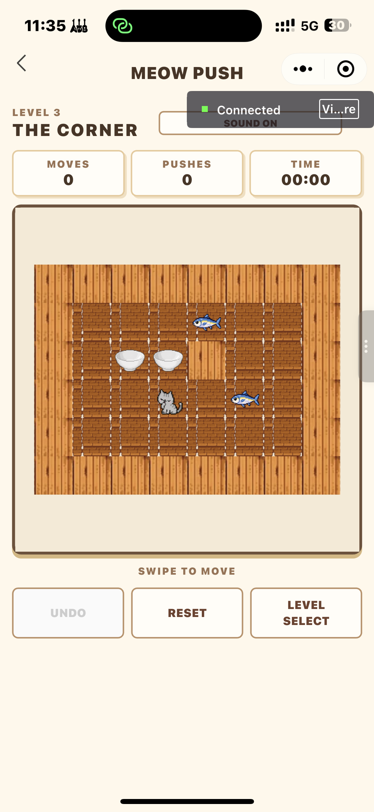
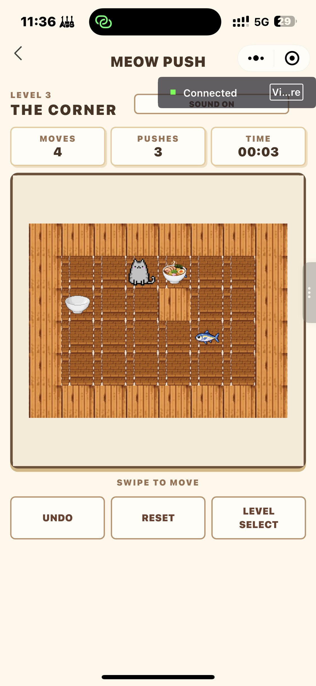
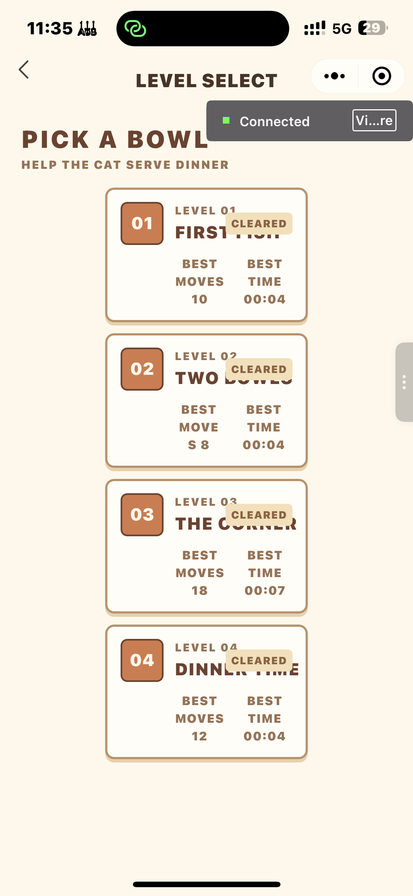
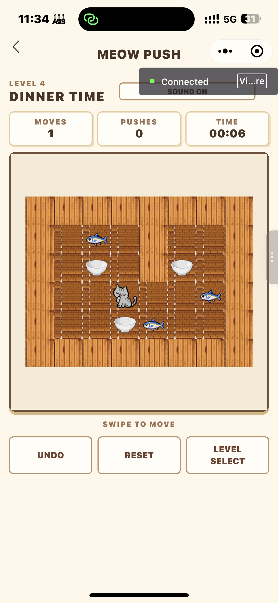
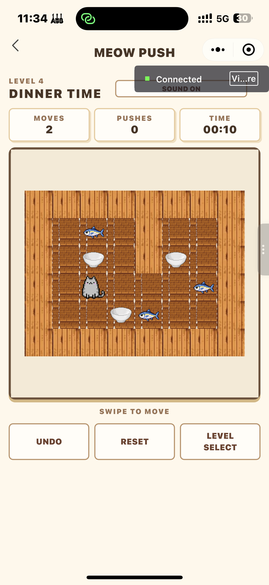
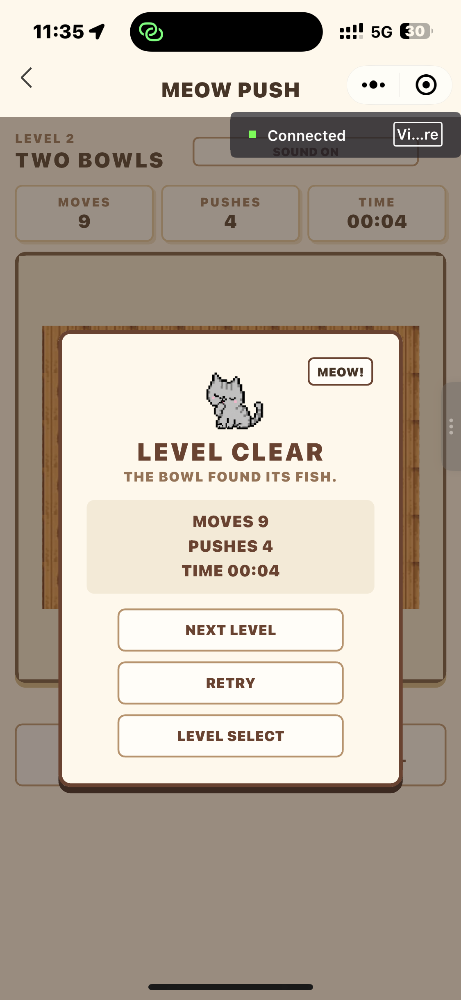

# 2026夏移动软件开发实验四


<div align="center">姓名：李宛霖　　学号：24020007064</div>

| 项目 | 内容 |
| --- | --- |
| 课程 | 中国海洋大学《移动软件开发》 |
| 实验名称 | 实验 4：MEOW PUSH 像素推饭碗小程序 |
| 项目主题 | MEOW PUSH |
| 博客地址 | https://7m7666.github.io/ |
| 代码仓库地址 | https://github.com/7M7666/Mobile-Development2026 |

<!--more-->

## 1 实验目的

1. 使用微信原生小程序的 WXML、WXSS、JavaScript 和 Canvas 2D 完成一个可玩的格子类小游戏，不使用 npm、游戏引擎或第三方 UI 框架。
2. 理解推箱子中静态地图、目标点、玩家和可移动物体应分开保存的原因，并据此实现移动、推动、碰撞与通关判断。
3. 学习 Canvas 节点初始化、高 DPI 绘制、图片资源加载和逐格渲染，完成像素风棋盘、猫、空碗、满碗和鱼目标的显示。
4. 实现关卡选择、逐关解锁、步数、推动次数、计时、Undo、重置和本地进度保存等完整游戏流程。
5. 使用触摸手势控制移动，并加入行走、待机、通关反馈和短音效，练习在动画状态下避免重复输入。
6. 结合实际调试信息，处理目标点恢复、页面返回、素材透明背景、资源体积和难度递增等问题。

## 2 实验要求与完成内容

本实验围绕微信原生小程序完成一个像素风推箱子游戏。游戏中的玩家是猫咪，传统箱子替换为空碗，目标点替换为鱼。猫咪需要把所有空碗推到鱼的位置，碗到达目标位置时显示为满碗。

结合项目要求和当前代码，完成内容如下：

1. 配置首页、选关页和游戏页三个页面，形成“首页 → 选关 → 游戏 → 通关反馈”的流程。
2. 使用 Canvas 2D 按地板、墙、鱼、碗、猫的层次绘制棋盘。空碗在鱼的位置上显示为满碗，但满碗仍可被继续推动。
3. 编写四个可解关卡，第一关用于熟悉规则，后续关卡逐步增加碗的数量、墙体和路线安排。
4. 实现有效移动、推碗、墙体阻挡、碗与碗阻挡、胜利判断、移动统计、推动统计和从第一次有效移动开始的计时。
5. 支持 Canvas 区域滑动控制，支持撤销和重置。无效碰撞不增加步数、不进入撤销记录。
6. 使用 `wx.getStorageSync()` 和 `wx.setStorageSync()` 保存解锁关卡、已通关关卡、最佳记录、最近关卡和声音开关。
7. 使用猫咪默认帧、两张待机帧、三张行走帧和欢迎页素材。首页的声音按钮放在右上角，游戏页也提供声音开关。

## 3 总体设计

### 3.1 项目结构与页面职责

实验四小程序的主要文件组织如下：

```text
project/
├─ app.js                         小程序启动、前后台处理和全局进度
├─ app.json                       三个页面和自定义导航栏配置
├─ data/levels.js                 4 个关卡的地图和初始坐标
├─ utils/game.js                  移动、碰撞、目标与通关规则
├─ utils/storage.js               本地进度的读取、规范化和时间格式化
├─ utils/sound.js                 推碗、通关音效管理
├─ pages/index/                   首页
├─ pages/levels/                  选关页
├─ pages/game/                    Canvas 游戏页
├─ components/navigation-bar/     自定义导航栏
└─ assets/                        猫、碗、鱼、地板、墙和音频资源
```

`app.json` 实际注册了 `pages/index/index`、`pages/levels/levels` 和 `pages/game/game` 三个页面。项目使用自定义导航栏，因此页面之间通过 `wx.navigateTo()`、`wx.redirectTo()` 等方式完成导航，不使用 tabBar。

页面分工如下：

```text
首页 index
  ├─ 显示欢迎猫、开始/继续、选关、已通关数量和声音开关
  └─ 读取最近一次关卡，进入游戏或选关页

选关页 levels
  ├─ 根据缓存生成四张关卡卡片
  ├─ 显示 AVAILABLE、LOCKED 或 CLEARED
  └─ 显示已通关关卡的最佳步数和最佳时间

游戏页 game
  ├─ 初始化 Canvas 和图片资源
  ├─ 处理 Swipe、Undo、Reset 与声音开关
  ├─ 绘制棋盘、运行动画、统计时间
  └─ 通关后写入记录并显示下一关、重试和选关按钮
```

### 3.2 游戏状态设计

推箱子中最容易出错的是目标点。若把“空地、鱼、空碗、满碗、猫”全部混在同一个二维数组中，碗离开鱼的位置时很容易不知道原位置是否应该恢复为鱼。因此本项目没有把满碗作为一种新的逻辑方块，而是将状态拆分为四部分：

```js
{
  staticMap, // 0 为地板，1 为墙，只读
  targets,   // 鱼的位置数组
  player,    // 当前猫坐标
  boxes      // 当前空碗坐标数组
}
```

关卡数据位于 `data/levels.js`。以下是第一关的真实结构，`playerStart`、`boxesStart` 和 `targets` 都是独立坐标：

```js
{
  id: 1,
  name: 'FIRST FISH',
  staticMap: [
    [1, 1, 1, 1, 1, 1, 1, 1],
    [1, 0, 0, 0, 0, 0, 0, 1],
    [1, 0, 0, 0, 0, 0, 0, 1],
    [1, 0, 0, 0, 0, 0, 0, 1],
    [1, 1, 1, 1, 1, 1, 1, 1],
  ],
  playerStart: { row: 2, col: 1 },
  boxesStart: [{ row: 1, col: 5 }],
  targets: [{ row: 1, col: 3 }],
}
```

这样设计后，碗是否已经送到鱼的位置只需要判断其坐标是否出现在 `targets` 内：

```js
function checkWin(boxes, targets) {
  return boxes.every(box => isTarget(targets, box.row, box.col))
}
```

`boxes.every(...)` 表示每只碗都必须到达一个目标位置才算通关。碗离开目标后 `isTarget()` 仍然可以返回原来的鱼位置，渲染层自然能够再次画出鱼。

### 3.3 游戏数据流

一次有效滑动从用户输入到画面更新的过程如下：

```text
Canvas touchstart / touchend
        ↓ 计算 dx、dy，确定上下左右
game.js 的 move(direction)
        ↓
utils/game.js 的 tryMove(state, direction)
        ↓
返回 moved、pushed 和新的 gameState
        ↓
保存 Undo 快照，更新 moves / pushes / timer
        ↓
视觉坐标插值，Canvas render()
        ↓
checkWin() 为真时播放通关反馈并保存进度
```

进度数据流为：

```text
通关或切换声音
        ↓
app.saveProgress(progress)
        ↓
utils/storage.js 的 saveProgress()
        ↓ wx.setStorageSync('meowPushProgressV1', normalized)
本地缓存
        ↓
首页 onShow / 选关页 onShow 读取 getApp().globalData.progress
        ↓
setData() 更新按钮文字、通关数和关卡卡片
```

### 3.4 本地缓存结构

缓存键名固定为 `meowPushProgressV1`。`storage.js` 先提供默认进度，再对读取到的数据做校验和补全，避免旧缓存缺少 `soundOn` 等新字段时造成页面异常。当前结构如下：

```js
{
  version: 1,
  unlockedLevel: 1,
  clearedLevels: [],
  lastLevel: 1,
  levelProgress: {
    1: {
      cleared: true,
      bestMoves: 8,
      bestPushes: 2,
      bestTime: 12000
    }
  },
  soundOn: true
}
```

其中 `bestTime` 用毫秒保存，展示前由 `formatTime()` 转成 `mm:ss`。刷新页面时使用缓存中的 `lastLevel` 确定“START”或“CONTINUE”应进入哪一关。

## 4 实验过程与关键代码

### 4.1 创建页面和首页交互

我先在 `app.json` 中注册三个页面，并在首页放置开始/继续、选关、通关数量和声音按钮。首页没有直接把“继续”写死，而是在 `onShow()` 中重新读取全局进度。这样从游戏页通关并返回首页后，按钮文案和 `x / 4 CLEARED` 能及时刷新。

```js
onShow() {
  const progress = getApp().globalData.progress
  const hasHistory = progress.clearedLevels.length > 0 || Object.keys(progress.levelProgress).length > 0
  this.setData({
    primaryActionText: hasHistory ? 'CONTINUE' : 'START',
    clearedCount: progress.clearedLevels.length,
    soundOn: progress.soundOn,
  })
}
```

欢迎页使用 `cat-home.png` 作为主视觉，该图片由提供的欢迎素材处理得到。`SOUND ON/OFF` 没有放在主按钮组中，而是定位在页面右上区域，避免尺寸过大抢占首页的主操作位置。

<p align="center"></p>
<p align="center">图 1　MEOW PUSH 首页，右上角为较小的声音开关。</p>

### 4.2 编写可复用的移动与碰撞逻辑

核心规则集中写在 `utils/game.js`，游戏页只负责调用，不在页面事件里重复判断墙、碗和目标。`tryMove()` 的处理顺序是先计算猫的下一格，再判断墙；若下一格有碗，则继续检查碗前一格是否是墙或另一只碗。

```js
const boxIndex = getBoxIndex(state.boxes, nextPlayer.row, nextPlayer.col)

if (boxIndex === -1) {
  const nextState = cloneState(state)
  nextState.player = nextPlayer
  return { moved: true, pushed: false, state: nextState }
}

const nextBox = {
  row: nextPlayer.row + direction.dr,
  col: nextPlayer.col + direction.dc,
}

if (isWall(state.staticMap, nextBox.row, nextBox.col) ||
    getBoxIndex(state.boxes, nextBox.row, nextBox.col) !== -1) {
  return { moved: false, pushed: false, state }
}
```

只有成功移动才会返回新状态。游戏页据此决定是否保存撤销记录、增加 `moves`，以及是否增加 `pushes`：

```js
const result = tryMove(this.gameState, direction)
if (!result.moved) {
  this.setData({ statusText: 'Blocked.' })
  return
}

this.saveUndoSnapshot()
this.gameState = result.state
this.moves += 1
if (result.pushed) {
  this.pushes += 1
}
```

这种分工使 Swipe、Undo、统计和动画都围绕同一个移动结果工作。撞墙或连续推两个碗时，`result.moved` 为 `false`，所以不会出现“位置没变但步数增加”的情况。

### 4.3 绘制 Canvas 棋盘并适配屏幕

游戏页在 `onReady()` 中通过 `wx.createSelectorQuery()` 取得 `type="2d"` 的 Canvas 节点。为了避免高分屏上出现模糊，Canvas 的实际像素宽高乘以设备的 `pixelRatio`，绘图上下文随后按同一比例缩放。逻辑绘制仍使用页面宽高，不需要在每一次 `drawImage()` 时重复换算。

```js
const pixelRatio = wx.getSystemInfoSync().pixelRatio || 1
this.canvas = canvasInfo.node
this.ctx = this.canvas.getContext('2d')
this.canvasWidth = canvasInfo.width
this.canvasHeight = canvasInfo.height
this.canvas.width = this.canvasWidth * pixelRatio
this.canvas.height = this.canvasHeight * pixelRatio
this.ctx.scale(pixelRatio, pixelRatio)
this.ctx.imageSmoothingEnabled = false
```

每次渲染时，程序根据地图的行列数计算 `tileSize`，再计算 `offsetX` 和 `offsetY`，使不同大小的关卡都居中显示。绘制顺序为地板、墙、鱼、碗、猫。鱼先画在目标点上，然后检查碗坐标：碗在目标上就画满碗，否则画空碗。

```js
const bowlImage = isTarget(targets, box.row, box.col)
  ? images.bowlFull
  : images.bowlEmpty
ctx.drawImage(bowlImage, x + pulseInset, y + pulseInset, size, size)
```

### 4.4 实现 Swipe、统计、计时和 Undo

正式游戏页没有保留方向按键，只在 Canvas 内接收 Swipe。触摸开始时保存起点，触摸结束时计算位移。最大位移小于 28px 的触摸视为普通点击，避免手指轻微抖动也触发移动；斜向滑动取水平或垂直位移更大的方向。

```js
const dx = touch.clientX - this.touchStart.x
const dy = touch.clientY - this.touchStart.y
if (Math.max(Math.abs(dx), Math.abs(dy)) < SWIPE_THRESHOLD) {
  return
}

if (Math.abs(dx) > Math.abs(dy)) {
  this.move(dx > 0 ? 'right' : 'left')
} else if (Math.abs(dy) > Math.abs(dx)) {
  this.move(dy > 0 ? 'down' : 'up')
}
```

计时器第一次有效移动后才启动。小程序退到后台时，`App.onHide()` 调用当前游戏页的 `pauseExperience()`，将已经累计的时间写回 `elapsed`；返回前台再继续计时，因此后台停留时间不会被算进关卡成绩。

Undo 在每次有效移动前保存深拷贝，包括猫的位置、所有碗的位置、步数、推动次数、累计时间以及计时状态。撤销栈上限是 100，超出后移除最早记录。

```js
this.undoStack.push({
  player: clonePosition(this.gameState.player),
  boxes: this.gameState.boxes.map(clonePosition),
  moves: this.moves,
  pushes: this.pushes,
  elapsed: this.getElapsed(),
  timerRunning: this.timerRunning === true,
  timerHasStarted: this.timerHasStarted === true,
})
if (this.undoStack.length > MAX_UNDO_HISTORY) {
  this.undoStack.shift()
}
```

<p align="center"></p>
<p align="center">图 2　第 3 关开始时的棋盘、统计栏和 Swipe 提示。</p>

<p align="center"></p>
<p align="center">图 3　第 3 关移动后的棋盘，HUD 显示 Moves、Pushes 和 Time。</p>

### 4.5 设计四个关卡并检查难度

四关均在 `levels.js` 中用相同的数据结构定义。关卡数量从 1 只碗增加到 3 只碗，最后两关增加内部墙体与路线限制。选关页不保存一套重复的卡片数据，而是每次在 `onShow()` 中遍历 `levels` 和本地进度，生成当前的 `levelCards`。

```js
const levelCards = levels.map(level => {
  const cleared = progress.clearedLevels.includes(level.id)
  const available = level.id <= progress.unlockedLevel
  const record = progress.levelProgress[level.id]
  return {
    id: level.id,
    displayId: String(level.id).padStart(2, '0'),
    name: level.name,
    status: cleared ? 'CLEARED' : available ? 'AVAILABLE' : 'LOCKED',
    locked: !available,
    bestMoves: record && record.bestMoves !== undefined ? record.bestMoves : '--',
    bestTime: record && record.bestTime !== undefined ? formatTime(record.bestTime) : '--:--',
  }
})
```

为避免只凭感觉判断后面的关卡是否更简单，我使用 Node 按上下左右搜索可达状态，并以最少的有效移动次数作为一个基础检查。结果为 8、9、11、20 步，第四关的最短解明显长于前三关。这个数字只说明关卡存在解且路线长度递增，不代表不同玩家的实际体感一定完全相同。

| 关卡 | 名称 | 碗数量 | 最短有效移动次数 | 设计作用 |
| --- | --- | ---: | ---: | --- |
| 1 | FIRST FISH | 1 | 8 | 熟悉走路、推动和目标点 |
| 2 | TWO BOWLS | 2 | 9 | 处理两只碗的先后位置 |
| 3 | THE CORNER | 2 | 11 | 需要绕开内部墙体 |
| 4 | DINNER TIME | 3 | 20 | 同时安排三只碗与最终路线 |

<p align="center"></p>
<p align="center">图 4　选关页显示关卡状态与已通关关卡的记录。</p>

<p align="center"></p>
<p align="center">图 5　第 4 关初始状态，包含三只碗、三条鱼和内部墙体。</p>

<p align="center"></p>
<p align="center">图 6　第 4 关移动过程中的棋盘状态。</p>

### 4.6 加入移动、待机、通关动画与音效

逻辑位置和画面位置没有共用同一个对象。`tryMove()` 得到新逻辑状态后，`gameState` 会立即更新，但 Canvas 用 `playerVisual` 和 `boxVisuals` 在 100ms 内从旧坐标插值到新坐标。动画运行期间 `isBusy()` 为真，新的 Swipe、Undo、Reset 和选关操作都会被忽略，避免连续输入抢占同一份状态。

```js
const progress = Math.min(1, elapsed / MOVE_DURATION)
const easedProgress = 1 - Math.pow(1 - progress, 3)
this.playerVisual = interpolatePosition(
  animation.playerStart,
  animation.playerEnd,
  easedProgress
)
```

猫咪有三种显示状态。正常时使用 `cat-default.png`，约 2.4 秒没有操作后，在 `cat-idle-1.png` 与 `cat-idle-2.png` 间切换；移动时依次使用三张行走帧。通关时让最后移动的满碗有 300ms 的轻微放大，再弹出结果面板。音效由 `wx.createInnerAudioContext()` 创建，当前只保留推碗和通关两个短 WAV 文件，声音开关保存到本地进度中。

<p align="center"></p>
<p align="center">图 7　通关后显示本局 Moves、Pushes、Time 以及下一关、重试和选关操作。</p>

## 5 遇到的问题与解决过程

### 5.1 碗离开鱼后，目标点容易丢失

**现象：** 如果把“满碗”直接作为地图中的一种新状态，空碗被推出鱼位置后，原格可能变成普通地板，鱼无法恢复显示。

**原因：** 目标点和可移动碗被写进同一份格子状态，覆盖后没有保存原先的目标信息。

**修改：** 将 `staticMap`、`targets`、`player`、`boxes` 分开保存。`targets` 始终保留鱼的坐标；绘制碗时再调用 `isTarget(targets, box.row, box.col)` 决定使用空碗还是满碗图片。

**验证：** 同一只碗可以进入鱼的位置、离开该位置，再次进入。通关判断始终由全部碗坐标是否命中目标决定，而不是由“满碗数量”决定。

### 5.2 直接让动画修改逻辑坐标会造成连续输入问题

**现象：** 动画刚开始时继续滑动，可能出现猫或碗看起来跳格，或统计与画面不同步。

**原因：** 如果每一帧都直接修改 `player.row`、`player.col` 等游戏坐标，下一次输入会读到未完成的中间状态，碰撞判断也不再只针对格子坐标。

**修改：** 移动开始时先通过 `tryMove()` 一次性得到完整的新 `gameState`，只让 `playerVisual` 和 `boxVisuals` 做插值。`isAnimating` 或 `isCelebrating` 为真时，`isBusy()` 会阻止新的操作。

**验证：** 移动完成后视觉位置会重新同步到逻辑坐标。快速滑动时，多余输入不会排队，步数也不会额外增加。

### 5.3 从游戏页返回会落到旧关卡页面

**现象：** 多次从选关页打开不同关卡后，若用普通的返回栈逻辑，有可能返回到先前保留的游戏页，而不是选关页。

**原因：** `navigateTo()` 会把页面压入页面栈。页面栈中留有旧游戏页时，直接 `navigateBack()` 只会弹出当前页，目标并不一定是选关页。

**修改：** 自定义导航栏增加“返回选关页”的分支，游戏页不依赖普通返回栈，而是将当前游戏页替换为选关页。

**验证：** 从任意关卡点击返回后回到选关页，再从选关页选择关卡，不会显示上一局残留的棋盘状态。

### 5.4 原始猫素材背景与游戏画面不一致

**现象：** 提供的原始猫图分辨率较大，部分带白底、黑底或棋盘格背景。直接放入浅色木地板画面时，背景边缘很明显，包体也会增大。

**原因：** 原素材并非全部是游戏内 128×128 像素格的透明精灵图。

**修改：** 游戏运行时使用裁小后的透明 PNG。默认状态用第一张默认猫图，静止时只在两张待机图之间切换，欢迎页使用单独的 `cat-home.png`。这样不把不同状态混用，也能避免原图背景破坏棋盘。

**验证：** Canvas 内猫、碗与鱼都在同一格子尺寸下绘制，猫停留一段时间后才切换待机帧，首页使用欢迎页素材而非游戏行走帧。

### 5.5 后面的关卡初版过于容易

**现象：** 早期布局中，第四关可以很快推完，难度甚至低于前面的关卡。

**原因：** 仅增加碗数量不能保证难度增加。如果碗和目标对齐、玩家绕行空间过大，路线仍然很短。

**修改：** 调整第 2 至第 4 关的初始坐标和内部墙体，第 4 关使用三只碗并要求经过更长的绕行路线。调整后再用状态搜索确认各关可解。

**验证：** 当前四关的最短有效移动次数为 8、9、11、20。最少步数随关卡编号递增，第四关不再比第一关简单。

### 5.6 声音开关既要缩小，也要跨页面保持一致

**现象：** 首页最初的声音按钮占据了主要内容区域，看起来比开始按钮还醒目；如果只改当前页面数据，进入游戏页后声音状态又会不一致。

**原因：** 声音状态若只保存在页面 `data` 中，每个页面都会有自己的值，无法自然同步。

**修改：** 首页将声音按钮移到右上角并缩小。声音开关通过 `app.saveProgress()` 写入 `soundOn`，同时更新 `getApp().globalData.progress` 和本地缓存，游戏页读取同一状态。

**验证：** 首页和游戏 HUD 均显示同一个 `SOUND ON/OFF` 状态。重新进入页面后，开关仍按缓存中的设置显示。

## 6 实验结果与测试

### 6.1 功能完成情况

| 检查内容 | 实际结果 |
| --- | --- |
| 页面流程 | 已完成首页、选关、游戏与通关反馈；游戏页返回选关页，不回到旧关卡 |
| 基础移动 | 可以在地板上移动；撞墙、碗前是墙、碗前是另一只碗时不移动 |
| 目标点 | 鱼位置独立保存，碗到达时显示满碗，离开时鱼可恢复显示 |
| 统计 | 只统计有效移动，成功推动才增加 Pushes；第一次有效移动开始计时 |
| Undo 与 Reset | Undo 可恢复玩家、碗、统计和时间，最多保存 100 步；Reset 恢复初始状态 |
| 四个关卡 | 共有 4 关，逐关解锁；逻辑搜索得到的最短有效移动数为 8、9、11、20 |
| 本地缓存 | 保存已解锁、已通关、最佳步数、最佳推动次数、最佳时间、最近关卡和声音设置 |
| 触摸控制 | Canvas 支持上下左右 Swipe，28px 以下的短触摸不触发移动 |
| 视觉与音效 | 具备默认、待机、行走和通关反馈；推碗与通关各有一个短音效 |


## 7 实验总结

这次实验的核心不是把猫、碗和鱼画出来，而是先把游戏状态设计清楚。将墙和地板放在 `staticMap`，把鱼放在 `targets`，再独立保存猫和碗的位置后，移动、通关、Undo、重置和渲染都围绕同一个模型实现。尤其是“满碗只是显示状态”这一点，使碗离开目标和目标恢复显示不再需要额外补丁。

我对 Canvas 小程序的理解也更具体了。页面 WXML 适合放统计栏、按钮和通关面板，Canvas 则专注棋盘和角色。高 DPI 初始化、按行列计算 tileSize、关闭图像平滑、按固定顺序绘制图层，这几步一起决定了像素风画面能否稳定显示。图片素材不能只看电脑上的原图，透明背景、统一尺寸和资源大小都会直接影响最终效果。

在交互方面，Swipe 并没有另写一套移动规则，而是把方向转换后继续调用同一个 `tryMove()`。这让我意识到，后续增加控制方式时应该复用核心状态逻辑，而不是在各个事件函数里复制碰撞判断。动画也是同样的思路：逻辑状态一次更新，视觉状态单独插值，才能既保持画面连续，又保证统计和碰撞仍然只按格子坐标计算。

最后，关卡设计需要实际验证。碗更多不等于关卡更难，只有检查路线、死角和最短解，才能发现后面关卡是否真的变得简单。当前状态搜索确认四关都可解，并且最短路线从 8 步增加到 20 步。后续若继续完善，我会优先在不同尺寸的真机上检查 Canvas 尺寸、滑动阈值和音频实际播放情况，再根据真实试玩感受细调关卡。

## 8 不足之处

1. 当前最短步数搜索只作为关卡可解性和路线长度检查，没有在界面中给出提示，也没有实现排行榜。
2. 目前音效只包含推碗和通关两个短音频，没有背景音乐。这样有利于控制包体，但游戏氛围仍可以继续细化。


---

> 作者: 7M7  
> URL: https://7m7666.github.io/posts/2026-summer-mobile-development-experiment-4/  

